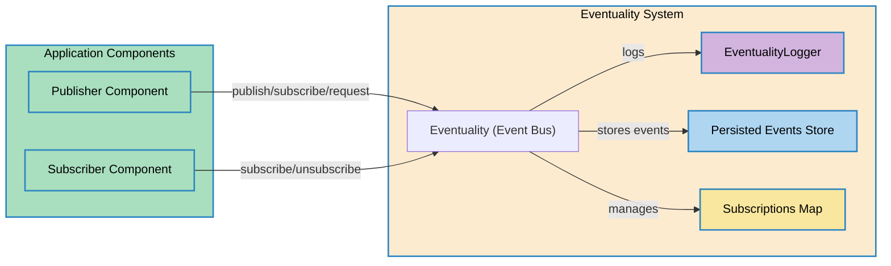

# Eventuality 📢🚍️

## *Event Bus for Web Components*

 

---

## Project Description

Eventuality is a modular, type-safe event bus system for web applications, designed to decouple communication between components (especially Web Components) using a robust publish-subscribe pattern. It supports asynchronous event processing, event persistence, clustering, and advanced debugging, all managed through a singleton instance. Eventuality is implemented in TypeScript, but its architecture is language-agnostic and can be ported to other environments.

---

## Features

- **Publish-Subscribe Pattern:** Decoupled communication between publishers and subscribers.
- **Asynchronous Processing:** Non-blocking event delivery using a FIFO queue.
- **Event Persistence:** Store events for late subscribers.
- **Clustering:** Targeted event delivery to logical groups (clusters).
- **Debug Mode:** Detailed logging and tracing for development and troubleshooting.
- **Singleton Pattern:** Ensures a single event bus instance per application.
- **Type Safety:** Strong typing for events and handlers (TypeScript).

---

## Project Structure

- `src/`: Core source code (see `Eventuality.ts` for main logic)
- `documentation/`: Technical docs, diagrams, and API reference
- `examples/`: Usage and integration examples
- `test/`: Automated tests
- `images_for_readme/`: Project images and logos

---

## Getting Started

### 1. Installation

```bash
npm install # or yarn install
```

### 2. Usage Example

```typescript
import { Eventuality, BaseEvent, EventHandler } from './src/Eventuality';

const event: BaseEvent<{ userId: number }> = { eventType: 'USER_REGISTERED', data: { userId: 1 } };
const handler: EventHandler<{ userId: number }> = Object.assign(
  (event) => { console.log(event.data.userId); },
  { id: Symbol('handler'), className: 'UserComponent' }
);
const bus = Eventuality.getInstance({ debugMode: true });
bus.subscribe(event, handler, 'main');
bus.publish(event, new Set(['main']), true);
```

---

## API Overview

Eventuality exposes a simple, powerful API:

- `publish(event, clusters?, persist?)`: Publish an event to clusters, optionally persisting it.
- `subscribe(event, handler, cluster?)`: Register a handler for an event type and cluster.
- `unsubscribe(event, handler)`: Remove a handler from an event type.
- `request(requestDetails, clusters)`: Request-response pattern for advanced workflows.

For full details, see [`documentation/API.md`](./documentation/API.md).

---

## Architecture



---

## Key Concepts

- **Event:** Object with `eventType` and `data` (see `BaseEvent<T>`)
- **Handler:** Function with metadata that processes events (see `EventHandler<T>`)
- **Cluster:** Logical group for event delivery
- **Persistence:** Store events for late subscribers
- **Singleton:** Only one event bus instance per app

See [`documentation/Glossary.md`](./documentation/Glossary.md) for more.

---

## Testing

Run all tests:

```bash
npm test
```

---

## Linting

Check code style and quality:

```bash
npm run lint
```

---

## Documentation

- [Architecture](./documentation/Architecture.md)
- [Design](./documentation/Design.md)
- [Requirements](./documentation/Requirements.md)
- [Data Flow](./documentation/DataFlow.md)
- [API Reference](./documentation/API.md)
- [Glossary](./documentation/Glossary.md)
- [Use Cases](./documentation/UseCases.md)
- [References](./documentation/References.md)

---

## License

MIT License. See [LICENSE](./LICENSE) for details.

---

## Author

Created by Luis Bartolessi. See [GitHub](https://github.com/lbartolessi/eventuality).

---

## Contributing

Contributions are welcome! Please open issues or pull requests.

---

## Development

- See `test/` for automated tests
- See `examples/` for integration and usage examples
- See `documentation/` for technical docs and diagrams

---

## Acknowledgements

Special thanks to all contributors and the open-source community.

---


