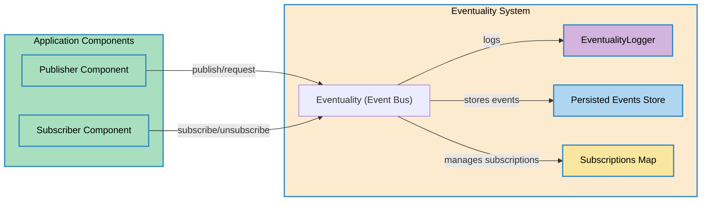

# Eventuality 📢🚍️

## ```Event Bus for TypeScript Applications```

 

---

## Project Description

Eventuality is a lightweight, modular, and type-safe event bus system designed to facilitate decoupled communication within single-instance TypeScript applications (both Node.js and browser environments). It provides a robust publish-subscribe pattern, supports asynchronous event processing, automatic event persistence for late subscribers, and flexible error handling, all managed through a configurable singleton instance.

---

## Features

- **Publish-Subscribe Pattern:** Decoupled communication between publishers and subscribers.
- **Asynchronous Processing:** Non-blocking event delivery using a FIFO queue.
- **Event Persistence:** Automatically stores events for target clusters if no active subscribers are present at the time of publication, delivering them upon subsequent subscription.
- **Clustering:** Targeted event delivery to logical groups (clusters).
- **Debug Mode:** Detailed logging and tracing for development and troubleshooting.
- **Singleton Pattern:** Ensures a single event bus instance per application.
- **Type Safety:** Strong typing for events and handlers (TypeScript).
- **Configurable Error Handling:** Define custom policies for handling errors thrown by event handlers.
- **Request-Reply Pattern:** Supports synchronous-like interactions over the asynchronous bus with built-in timeouts.

---

## Project Structure

- ```src/```: Core source code (see ```Eventuality.ts``` for main logic)
- ```documentation/```: Technical documentation (requirements, architecture, etc.)
- ```examples/```: Usage and integration examples (e.g., ```examples/node/demo.ts```)
- ```test/```: Automated tests
- ```images_for_readme/```: Project images and logos

---

## Getting Started

### 1. Installation

```bash
npm install # or yarn install
```

### 2. Quick Start Guide

Eventuality is designed for simplicity and type-safety. Here's how to get started:

#### a. Initialization
First, get an instance of the Eventuality bus. It's a singleton by default, ensuring a single point of control for your events. You can enable ```debugMode``` for verbose logging and provide a global ```handleError``` callback.

```typescript
import { Eventuality } from '@lbartolessi/eventuality';
import { ErrorHandlingAction } from '@lbartolessi/eventuality'; // Import ErrorHandlingAction type

const eventuality = Eventuality.getInstance({
  debugMode: true, // Set to false for production to reduce console noise
  handleError: (error: Error, event: any, handler: any, payload: any): ErrorHandlingAction | undefined => {
    console.error(```🚨 [App Error Handler] Error in ${event.eventType} handler ${handler?.className}: ${error.message}```);
    // Return 'stop_event', 'disable_handler', or undefined/'continue'
    // The global handler's return value takes precedence over handler.onError
    return 'continue';
  },
  waitTimeout: 0, // Optional: Time in ms to yield to the event loop between handler executions
});
```

#### b. Defining Events
Events are defined using ```createTypedEvent```, which provides strong typing for your event payloads.

```typescript
import { createTypedEvent } from '@lbartolessi/eventuality';

interface UserLoggedInPayload {
  userId: string;
  timestamp: number;
}
const userLoggedInEvent = createTypedEvent<UserLoggedInPayload>('USER_LOGGED_IN');

interface OrderPlacedPayload {
  orderId: string;
  amount: number;
  userId: string;
}
const orderPlacedEvent = createTypedEvent<OrderPlacedPayload>('ORDER_PLACED');
```

#### c. Creating Handlers
Handlers are functions that process event payloads. Use ```Eventuality.createEventHandler``` to wrap your handler logic, providing a context (```this```) and an optional ```onError``` policy for that specific handler.

```typescript
import { Eventuality } from '@lbartolessi/eventuality';

class EmailService {
  sendWelcomeEmail(payload: { userId: string }) {
    console.log(```Sending welcome email to user ${payload.userId}```);
  }
}
const emailService = new EmailService();
const welcomeEmailHandler = Eventuality.createEventHandler(emailService.sendWelcomeEmail, emailService);

// A handler with a specific error policy
const criticalErrorHandler = Eventuality.createEventHandler(() => {
  throw new Error('Simulated critical error!');
}, {}, 'disable_handler'); // This handler will be unsubscribed if it throws an error
```

#### d. Subscribing to Events
Subscribe your handlers to specific events. You can specify a ```cluster``` for targeted delivery, or omit it to subscribe to the global scope (```*```).

```typescript
eventuality.subscribe(userLoggedInEvent, welcomeEmailHandler, 'email-cluster');
eventuality.subscribe(orderPlacedEvent, welcomeEmailHandler); // Subscribes to '*' cluster
```

#### e. Publishing Events
Publish events with their payloads. You can target specific ```clusters``` or publish to all relevant subscribers.

```typescript
eventuality.publish(userLoggedInEvent, { userId: 'user-123', timestamp: Date.now() }, new Set(['email-cluster']));
eventuality.publish(orderPlacedEvent, { orderId: 'ORD-456', amount: 100.00, userId: 'user-123' });
```

#### f. Unsubscribing
Remove a handler's subscription when it's no longer needed.

```typescript
eventuality.unsubscribe(userLoggedInEvent, welcomeEmailHandler);
```

#### g. Request-Reply Pattern
For scenarios requiring a response, use the ```request``` method. This method returns a Promise that resolves with the reply payload.

```typescript
import { createTypedEvent, RequestPayload } from '@lbartolessi/eventuality';

interface GetProductDetailsRequest extends RequestPayload<ProductDetailsResponse> {
  productId: string;
}
interface ProductDetailsResponse {
  id: string;
  name: string;
  price: number;
}
const getProductDetailsRequest = createTypedEvent<GetProductDetailsRequest>('GET_PRODUCT_DETAILS');

// On the responder side (e.g., a backend service handler):
eventuality.subscribe(getProductDetailsRequest, Eventuality.createEventHandler((reqPayload) => {
  const response: ProductDetailsResponse = { id: reqPayload.productId, name: 'Sample Product', price: 29.99 };
  eventuality.publish(reqPayload.replyTo!, response); // Publish the response to the temporary reply channel
}, {}), 'product-service');

// On the requester side:
async function fetchProduct(productId: string) {
  try {
    const product = await eventuality.request(
      getProductDetailsRequest,
      { productId, clusterTo: 'product-service' }, // clusterTo is where the responder is listening
      new Set(['product-service']), // Publish the request to this cluster
      5000 // Timeout in milliseconds
    );
    console.log(```Fetched product: ${product.name} (ID: ${product.id})```);
  } catch (error: any) {
    console.error(```Failed to fetch product ${productId}: ${error.message}```);
  }
}
fetchProduct('PROD-XYZ');
```

### 3. Full Usage Example (Demo)

For a comprehensive demonstration of Eventuality's features, including event persistence, clustering, and error handling, refer to the ```demo.ts``` file.

To run the demo:

```bash
# First, build the project (this will also build the demo)
npm run build
# Then, run the compiled demo
node dist/demo.js
```

---

## API Overview

Eventuality exposes a simple, powerful API:

- ```publish(event, clusters?, persist?)```: Publish an event to clusters, optionally persisting it.
- ```subscribe(event, handler, cluster?)```: Register a handler for an event type and cluster.
- ```unsubscribe(event, handler)```: Remove a handler from an event type.
- ```request(requestPayload, clusters?, timeoutMs?)```: Request-response pattern for advanced workflows, returning a Promise.

For full details on method signatures and types, refer to the TypeScript declaration files in ```dist/types/``` or the source code.

---

## Architecture


```mermaid
flowchart LR
    subgraph EventualitySystem["Eventuality System"]
        EventualityBus["Eventuality (Event Bus)"]
        Logger["EventualityLogger"]
        PersistedStore["Persisted Events Store"]
        Subscriptions["Subscriptions Map"]
    end
    subgraph Application["Application Components"]
        Publisher["Publisher Component"]
        Subscriber["Subscriber Component"]
    end
    Publisher -- "publish/request" --> EventualityBus
    Subscriber -- "subscribe/unsubscribe" --> EventualityBus
    EventualityBus -- "logs" --> Logger
    EventualityBus -- "stores events" --> PersistedStore
    EventualityBus -- "manages subscriptions" --> Subscriptions
    style EventualitySystem fill:#FDEBD0,stroke:#2E86C1,stroke-width:2px,color:#000
    style Application fill:#A9DFBF,stroke:#2E86C1,stroke-width:2px,color:#000
    style Logger fill:#D2B4DE,stroke:#2E86C1,stroke-width:2px,color:#000
    style PersistedStore fill:#AED6F1,stroke:#2E86C1,stroke-width:2px,color:#000
    style Subscriptions fill:#F9E79F,stroke:#2E86C1,stroke-width:2px,color:#000
    style Publisher fill:#A9DFBF,stroke:#2E86C1,stroke-width:2px,color:#000
    style Subscriber fill:#A9DFBF,stroke:#2E86C1,stroke-width:2px,color:#000
```

---

## Key Concepts

- **TypedEvent:** A descriptor for a specific type of event, including its unique string identifier (```eventType```) and the expected payload type.
- **Handler:** Function with metadata that processes events (see ```EventHandler<T>```)
- **Cluster:** Logical group for event delivery
- **Persistence:** Store events for late subscribers
- **Singleton:** Only one event bus instance per app
- **Error Handling Action:** Defines how the bus reacts to errors (```continue```, ```stop_event```, ```disable_handler```).

For more detailed definitions, refer to the ```documentation/eventuality-requirements.md``` file.

---

## Testing

Run all tests:

```bash
npm test
```

---

## Linting

Check code style and quality:

```bash
npm run lint
```

---

## Documentation (Under Construction)

The comprehensive documentation for Eventuality is currently under development.

*   **Requirements:** See ```documentation/eventuality-requirements.md``` for the detailed functional and non-functional requirements.
*   **API Reference:** Coming soon.
*   **Architecture & Design:** Coming soon.
*   **Use Cases & Examples:** Coming soon.
*   **Glossary:** Coming soon.

---

## License

MIT License. See LICENSE for details.

---

## Author

Created by Luis Bartolessi. See GitHub.

---

## Contributing

Contributions are welcome! Please open issues or pull requests.

---

## Development

- See ```test/``` for automated tests.
- See ```examples/``` for integration and usage examples (e.g., ```examples/node/demo.ts```).
- See ```documentation/``` for technical documentation.

---

## Acknowledgements

Special thanks to all contributors and the open-source community.

---


